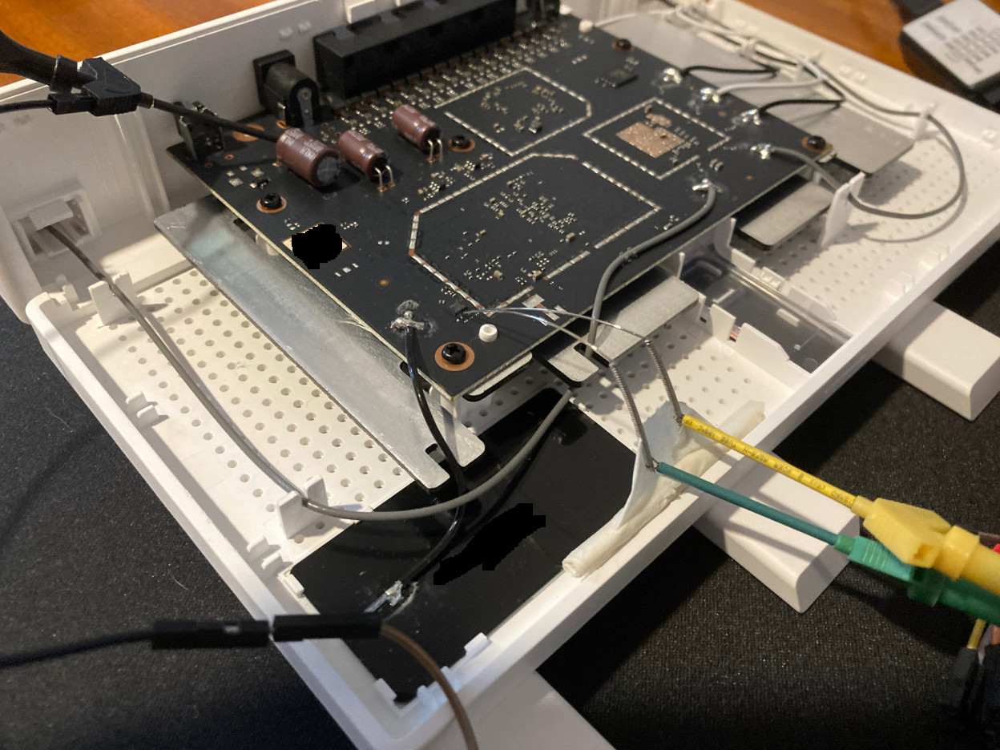

# xinfc

This repository contains tools for interfacing with the NFC chip on
Xiaomi routers.

## About

Some Xiaomi routers are NFC capable. This a convenient way to share network information, requiring only proximity to the router. While practical, the stock router firmware is not flexible, so, for instance, you can't tell it to share the guest network credentials instead of the main one.

Open source firmwares like OpenWRT are much more flexible, but some components are missing support, the NFC chips used by Xiaomi being some of them.

This repository aims to add some more functionality to these firmwares and make it practical to program Wi-Fi credentials to NFC chips.

## Disclaimer

The tools in this repository may break the NFC chip and/or the router if used incorrectly and may pose a security risk if exploited. None of the tools provided check the ID of the NFC chip before writing to it. Make sure the Router and NFC chip match the tested hardware. Use at your own risk.

## Tested hardware

| Router | NFC Chip | Firmware
|--------|----------|---------|
| Xiaomi AX3000T (RD03) | NT082C NTC1 320N0G (Fudan Microelectronics) | OpenWrt 23.05.2

## Required packages

- i2c-tools

## Finding I2C bus and I2C address

A router may have multiple I2C busses with many devices attached to it **even memory chips, that's why it is important to know what you are doing!** Luckily your router will have only one bus and a single device (the NFC chip). You can use `i2cdetect` to find devices on a bus. For instance, my AX3000T has only bus `0` and the NFC chip with address `0x57`:

```
root@OpenWrt:~# i2cdetect -y 0
     0  1  2  3  4  5  6  7  8  9  a  b  c  d  e  f
00:                         -- -- -- -- -- -- -- --
10: -- -- -- -- -- -- -- -- -- -- -- -- -- -- -- --
20: -- -- -- -- -- -- -- -- -- -- -- -- -- -- -- --
30: -- -- -- -- -- -- -- -- -- -- -- -- -- -- -- --
40: -- -- -- -- -- -- -- -- -- -- -- -- -- -- -- --
50: -- -- -- -- -- -- -- 57 -- -- -- -- -- -- -- --
60: -- -- -- -- -- -- -- -- -- -- -- -- -- -- -- --
70: -- -- -- -- -- -- -- --
```

The bus and address will be required by the tools to access the NFC chip.

## Tools

### xinfc-wsc

Programs a Wi-Fi Simple Configuration (WSC) NDEF on the NFC chip that can be scanned by Android devices to auto-connect to the network. Notice: The tool lacks WPA3 support. Mixed WPA3/WPA2 networks will be announced as WPA2.

`xinfc-wsc <i2c bus> <nfc chip i2c address> <network ssid> <network password> <network encryption>`

The network encryption is the same used by OpenWRT's `/etc/config/wireless`. Run `xinfc-wsc` without any arguments to see the full list of available encryption methods (some are not supported):

```
./xinfc-wsc 0 0x57 TestTests test1234 sae-mixed
```

`xinfc-wsc` will back up the current chip data to a file every time it runs. **Keep the first backup safe because it contains the original data programmed by the stock firmware**.

**Warning: The backup data may prove insufficient to restore the chip if something goes wrong!**

## Building xinfc

I've provided some scripts to build xinfc on Linux and OpenWRT 23. The OpenWRT cross-compiling is based on docker and uses [dimfishr's build](https://github.com/dimfishr/openwrt) as build root. The build instructions are also based on dimfishr's scripts. The dummy build is intended for testing and replaces all I2C calls with a proxy.

## Daemonizing the tools

The NFC chip does not require a daemon or service to work. Data is programmed once and that's it, it survives reboots **and the chip can even broadcast when the router is powered off!**. An automation should, ideally, program the chip on boot and every time the desired network changes.

## Known issues

I've noticed that the chip stops responding a lot. I've added retries to overcome this situation and I also noticed that the stock router firmware does this. Maybe it's a matter of tuning some I2C parameters, but I don't know.

## Adding more hardware

So far I tested this on my AX3000T:



I used two needles commonly used to clean 3D printer nozzles and probed the SCL/SDA pins directly. Then I connected a cheap logic analyzer to them. This shows how the router talks to the chip.

Contributions are welcome :)